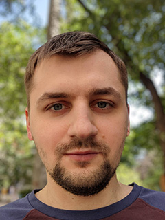

# Kyrylo Petrishchev

## Contact information
* __Phone:__ +3806665296**
* __Discord:__ @lumpen
* __Email:__ [ferka911@gmail.com](mailto:ferka911@gmail.com)
* __Git Hub:__ [ferka123](https://github.com/ferka123)
## About Me
My name is Kirill and I decided to change my occupation and become a front-end developer.  I am certain that joining RS school will help me with this new endeavor in my life.
## Skills
* HTML/CSS basics
* PHP basics
* Adobe Photoshop/inDesign/After Effects
## Code example
```
function solution(number){
  let sum = 0;
  for (let i = number-1; i > 0; i--) {
  if ((i % 3 == 0) || (i % 5 == 0)) sum = sum + i;
}
  return sum;
}
```
## Projects
* CV Markup - [Github](https://ferka123.github.io/rsschool-cv/cv)
## Education
* Volodymyr Dahl East Ukrainian university
  Master's degree: Computer Science - 2008-2013
* Rolling Scopes School
  JS/FE Preschool - ongoing
## Languages
* Ukrainian - Native
* Russian - Native
* English - C1 Advanced (according to [efset.org](https://www.efset.org/))

